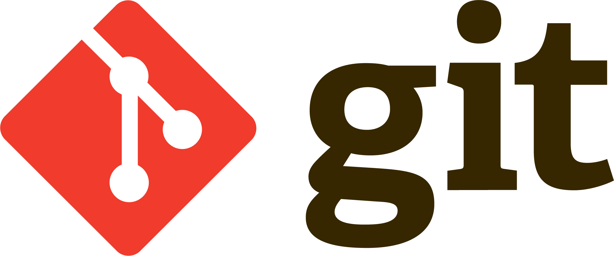

# Contenido

### Que es git

### Que es github

### Pasos para crear un sitio web personal

### Acción

### Otras aplicaciones

---
 # Que es git
 
.pull-left[

```{r, echo=FALSE, out.width="50%", fig.align = "center"}

```

]

.pull-right[

+ Software gratuito para realizar control de versiones a los programadores.

+ Permite el seguimiento de cambios en cualquier conjunto de archivos.

+ Construido por Linus Torvalds en 2005

+ Se descarga de la página : https://git-scm.com/ , dependiedo el sistema operativo (macOS, Windows, Linux/Unix)

+ Por lo general viene preinstalado en los cumputadores ( para saberlos se puede digitar en la terminal : `git --version`)

]

---
# Que es GitHub

.pull-left[

+ Es un servicio de alojamiento de  internet para el desarrollo de software y control de versiones (red social de progrmadores). Recientemente fué comprada por Microsof y mantiene su servicio gratuito.

+ Funciona como una cuenta de correo que hay que crear y administrar, sobre la cual se abren repositorio para manejar nuestros proyectos. 

]

.pull-right[

```{r, echo=FALSE, out.width="70%", fig.align = "center"}
knitr::include_graphics("img/github-logo.png")
```
]  

---

#  Pasos para crear cuenta :

  + Ir a la página : https://github.com/
  
  + Entrar por **Sign up**

  + Entrar una cuenta de correo (que identifica la cuenta y donde se envia código de verificación) 

  + Crear clave

  + Verificación mediante número enviado al correo 

  + Selección de número de personas del equipo / Estudiantes o profesor

  + Se elege la versión libre

---

# Pasos para crear un sitio personal

Existe varias forma de craar un sitio personal, en nuestro caso utilizaremos recursos libres (plantilla Minimal Bootstrap)  y Github como medio de publicación

 + **Paso 1** : verificar que tengamos instalado **git** en el computador. En caso contrario instalarlo
 
 + **Paso 2** : Configurar git en muestro computador
 
 + **Paso 3** : Obener una cuenta en GitHub
 
 + **Paos 4** : Crear un repositorio en GitHub
 
 + **Paso 5** : Clonar repositorio en nuestro computador
 
 + **Paso 6** : Crear archivos o personalizarlos desde muestro computador
 
 + **Paso 7** : Mi primera publicación  

---

# Producto final


|repositorio                                   | github                               |
|:---------------------------------------------|:-------------------------------------|
|https://abelalv.github.io/abel.io/            | https://github.com/abelalv/abel.io/  |  
|                                              |                                      |
|https://dgonxalex80.github.io/dgonzalezweb/   | https://github.com/dgonxalex80       |

### Referencias

+ [Minimal Bootstrap Template](https://templatemag.com/minimal-bootstrap-template/#google_vignette)

+ Imágenes libres
  + [pixabay](https://pixabay.com/)
  + [Pexels](https://www.pexels.com/es-es/)
  + [Unsplash](https://unsplash.com/es)
  
---

# Otras aplicaciones

### https://dgonxalex80.github.io/pye20222/

### https://abelalv.github.io/book-EDO/intro.html


---
class: center, middle

# Manos a la obra....
