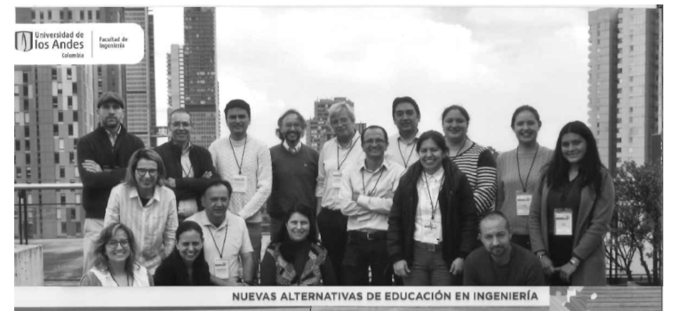
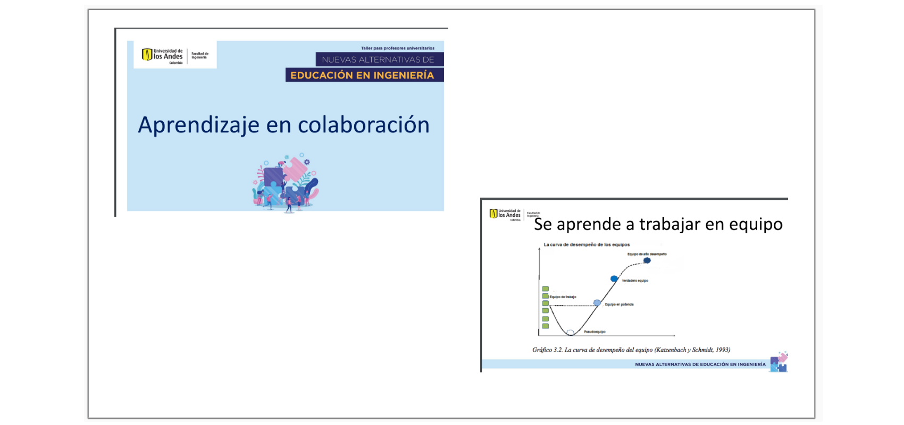

```{r setup, include=FALSE}
options(htmltools.dir.version = FALSE)
knitr::opts_chunk$set(
  fig.width=9, fig.height=3.5, fig.retina=3,
  out.width = "100%",
  cache = FALSE,
  echo = TRUE,
  message = FALSE, 
  warning = FALSE,
  hiline = TRUE
)


```

```{r xaringan-themer, include=FALSE, warning=FALSE}
library(xaringanthemer)
style_duo_accent(
  primary_color = "#0d3b66",
  secondary_color = "#f4d35e",
  inverse_header_color = "#FFFFFF"
)
```

## Introducción

## Metodología

## Experiencias exitosas

## Propuesta

---

## Introducción



Grupos : 5 grupos (4, 4, 3, 3 , 2) : 3 Uniandes, 1, Uruguay, 1 Javeriana Cali - dos facilitadoras, 2 profesores invitados, 2 asistentes de logística 

Se realizan activiades grupales para el conocimiento de los participantes : juegos, ficha

---

## Metodología

#### Desing-Thinking


---

## Metodología 

* Estrategias de integración y de conocimiento de los participantes
* Conformación de los equipos - roles complementarios
* Determinación del problema
* Generación de ideas sin restricciones - post it, agrupación por tematicas, elección del problema
* Elaboración del poster : 
    + Proyecto, 
    + Equipo, 
    + Objetivos, 
    + Este proyecto es importante porque, 
    + Buscamos desarrollar en los estudiantes (profesores), 
    + Estamos diseñando para, 
    + Contamos con los siguientes recursos, 
    + Nuestros retos y preocupaciones, 
    + Qué otros actores intervienen.
* Estrategia plus -delta. aportes externos
* Ajustes del poster
* Presentación de la propuesta 
---
### Estrategias de integración y de conocimiento de los participantes


-----


---
### Generación de ideas sin restricciones 


---
### Estamos diseñando para


---

### Proyecto


---
#### Proyecto : MINGA JAVE

|               |                                             |
|:--------------|:--------------------------------------------|
|Universidad    | Pontificia Universidad Javeriana Cali
|Miebreos del equipo |  Maribell Sacananboy, Iván Otálvaro, Daniel González|
|Objetivos      | Construir un ecosistema que propicie el desarrollo de competencias de trabajo multidisciplinar entre profesores y estudiantes (disciplinares y escenciales)  |
|Este proyecto es importante porque | Permite (propica, favorece) la interacción entre estudiantes y profesores en diferentes disciplinas . Genera un espacio (tiempo, físico, mental) de encuentro permanente entre estudiantes y profesores.|
|Buscamos desarrollar en los estudiantes (profesores) | Desarrollar habilidades de trabajo en equipo, Fortalecer el diálogo entre disciplinas, Incentivar a profesores y estudiantes al cambio (mover las transformaciones). Fortalecer la visión hoística.|

---

|               |                                             |
|:--------------|:--------------------------------------------|
|Estamos diseñando para | **MILAN**: Milan es un ingeniero Civil nacido en Montería, hijo de ingeniéros civiles y dueños de una firma constructora de proyectos de vivienda. Creció en medio de las obras que construían sus padres . Sus parques de diversión los conformaban los bancos de materiales y de las obras. Estudió Ingeniería en la Universidad Bolivariana , con honores, logrando una beca para estudiar doctorado directamente en la Universidad de Turín - IT.  Dado su apoyo económico tenia como requisito regresar a su pais y se le condonava su deuda si se vinculaba a una universidad. Participó y ganó una convocatoria para una profesor de planta de una univeridad privada de Cali, hoy dia imparte los cursos básicos de estructuras, donde aplica una estratégia didactica basada en clases magistrales y evalaciones escritas cortas y largas. Durante los últmos años no ha cambiado sus estrategias y conserva sus materiales semestre a semestre, pues siente que en el rigor está el existo de sus estudiantes.  Milan se ha venido distanciado de sus estudiantes  como tambien de sus colegas y hoy en dia no se sabe que lo motiva . *Cuando sea profesor universitario quiero crear un Instituto de Investigación dedicado a la protección sismica referente internacional* | 
|   | **INDIGO** : Indigo nació en Guachanal (Nariño) , vivia en casa con sus padres, hermanos y abuelos maternos. Es el mayor de una familia con cinco hijos. Sus padres son faficultores y con esfuerzo sostienen a Indigo en la universidad.  A pesar de haber estudiado en un colegio público de bajo nivel académico, obtuvo un alto desempeño en las pruebas de estado que le permitieron ingresar a la universidad y obtener un apoyo económico por parte del estado y de la universiad.  Es responsable con su propio aprendizaje, sin embargo, se distrae en las clases magistrales rque no se motiva lo suficiente . Sus compañeros lo an aislado por su promedio.  *Quisiera diseñar infraestructura sin dañar el medio ambiente* .  *Apenas salga de la universidad quiero transformar mi región, solucionar los problemas de infraestructura y saneamiento para mejorar la calidad de vida de la gente de mi región* |  


|               |                                             |
|:--------------|:--------------------------------------------|
|Contamos con los siguientes recursos | Espacios físicos que pueden ser ocuoados, Profesores motivados, con necesidades de compartir con otros. Posibilidades de inclusión en el  plan de trabajo. | 
|Nuestros retos y preocupaciones | Perder la autonomía del proyecto.  La inercia del trabajo individual. La resistencia al cambio. Propiciar un ambiente inclusivo |
|Qué otros actores intervienen | Directores de Departamento. Decanos. Apoyo administrativo (presupuesto, recursos físicos, compras). Comunidad (entidades públicas, empresas, vecinos, organizaciones) |

---
## Experiencias exitosas


---


---




---


* chek in , chek up
* plus , delta

---

## Propuesta

#### Temáticas

* Mejorar los proceso de evaluación en nuestras asignaturas, tanto de fundamentación como disciplinares.

* Articular estrategias didácticas con reforma curricolar en ingeniería- .

* Motivar proyectos de innovación curricular a corto plazo (2022-2) en asignaturas específícas (y de manera voluntaria) en donde se apliquen nuevas estrategias didácticas (no necesariamente de sus cursos, sino pensando en toda la Facultad).

#### Taller 

* Construir tantos  grupos como tematica se tengan 
* Al interior de cada grupo se construyen equipos (4-5 integrantes)
* Se aplica la metodología 
* Se hace una presentación - ponencia de los resultados
* Se seleccionan las mejores propuetas para su ejecución


