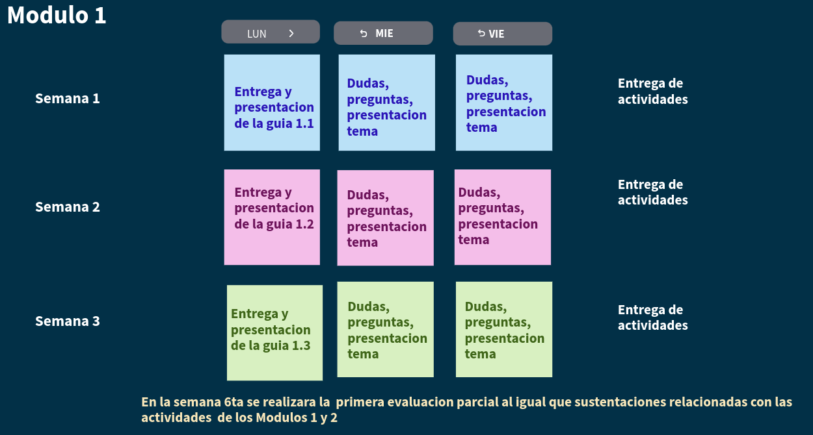

```{r setup, include=FALSE}
options(htmltools.dir.version = FALSE)
knitr::opts_chunk$set(
  fig.width=9, fig.height=3.5, fig.retina=3,
  out.width = "100%",
  cache = FALSE,
  echo = TRUE,
  message = FALSE, 
  warning = FALSE,
  hiline = TRUE
)
```

```{r xaringan-themer, include=FALSE, warning=FALSE}
library(xaringanthemer)
style_duo_accent(
  primary_color = "#023047",      #"#1381B0",  # azul marino 
  secondary_color ="#bbdffb",      # "#FF961C", # naranja
  inverse_header_color ="#FFFFFF"  # blanco
)
```


# Información básica

* Departamento que la ofrece: **Departamento de Ciencias Naturales y Matemáticas**
* Área de conocimiento: **Matemáticas y Ciencias Naturales**
* Núcleo Básico del Conocimiento:  **Matemáticas, Estadística y Áreas afines**

* Créditos : **3**
* Horas clase : **5 horas/semana** (4 x 16 = 64 h) (*)
* Horas de acompañamiento monitor : **1 hora/semana** (16 h)
* Total horas trabajo independiente : **64**
* Total de horas : **144**

* Prerrequisitos: Calculo integral
* Correquisitos:  NA
* Asignaturas equivalentes:  NA
* Cupo máximo por grupo:  30.
* Modalidad: **presencial** (dos sesiones presenciales y una sesión digital asincrónica digital)
* Idioma en que se imparte: español.

---
# Objetivos de aprendizaje
.pull-left[
|          |  OA1     |  OA3     | OA6      |
|:---------|:---------|:---------|:---------|
| FIC /ABET|   1      |   3      |  6       |
|Fórmula   |  [3]     |  [3]     |  [3]     |
|Indicador de desempeño  | 1.1 [3]  |  3.1 [3] | 6.1 [3]  |
|          |1.3 [1]   | 3.2 [3]  | 6.2 [3]  |
|          |1.4 [3]   | 3.3 [1]  | 6.3 [3]  |

**OA1**.	Interpretar e implementar conocimientos de **estadística y probabilidad** a través de su participación activa en el análisis de **información, situaciones y problemas** en contexto y áreas de conocimiento que permita orientar la **toma de decisiones informadas**.

]
.pull-right[
**OA3**.	Construir ideas a través de la **elaboración e interpretación de argumentos** de manera organizada y precisa, basados en evidencia estadísticas para favorecer el desarrollo de proyectos que aportan soluciones a problemas reales.

**OA6**.	**Aplicar métodos estadísticos** a través del lenguaje de programación **R** y herramientas de visualización para la solución a problemas que faciliten el aprendizaje de conceptos a través de **simulaciones** en el contexto de estadística y probabilidad para alcanzar validez de las soluciones
]
---
# Resultados de aprendizaje

**RA1**: **Apropiación** y **aplicación** de conocimientos básicos en ingeniería y ciencias 

**RA3**: **Comunicación** efectiva 

**RA6**: **Experimentación**, **medición** y **análisis**

---
# Contenido de la asignatura

.pull-left[
* **Módulo 1** Análiza tus datos 
  + Metodología estadística y bases de datos
  + Tablas de frecuencia e indicadores estadísticos
  + Visualización de datos

* **Módulo 2** Cuantifica la incertidumbre 
  + Conceptos básicos y enfoques de probabilidad
  + Tipos de probabilidad y sus aplicaciones

* **Módulo 3** Conoce sobre modelos estadísticos
  + Variables aleatorias
  + Variables aleatorias conjuntas
  + Modelos de probabilidad especiales

]
.pull-right[

* **Módulo 4**  Generaliza los resultados y prueba tus hipótesis 
  + Conceptos de inferencia estadística
  + Intervalos de confianza
  + Pruebas de hipótesis

* **Módulo 5** Aplica lo aprendido 
  + Modelo de regresión lineal simple
  + Modelo de regresión lineal múltiple   


**Nota**: 
**Módulo 0** : Lo que debes saber al empezar : sumatoria, productoria, teoria de conjuntos, conteo, funciones exponencial y logarítmica, derivación, integración.
]
---
# Estrategias didàcticas

**ED1**.	**Clase magistral**: [Plataforma web, **videos**, guías de aprendizaje, computador, tableta, herramienta computacional]

**ED2**.	**Método del caso**: [**Guía de aprendizaje** con enunciado de caso, computador, herramienta computacional]

**ED5**.	**Aprendizaje basado en problemas**: [**Guía de aprendizaje** con enunciados de problemas, solucionario de problemas]

**ED8**.	**Aprendizaje basado en simulaciones**: [**Guía de aprendizaje** con situaciones problema, herramienta computacional]

**Nota**: La herramienta computacional propuesta para el curso es **R**, también se incluyen herramientas de visualización de datos como Power BI, Tableau
---
```{r, echo=FALSE, out.width="100%", fig.align = "center"}

```
---
# Estrategias de evaluación

| Actividad                  | %         |  O de A     | Contenidos asociados | Resultados de aprendizaje esperados |
|:---------------------------|----------:|:------------|:---------------------|:------------------------------------|
| Actividades 1              | 5         | OA1,OA3, OA6| CA1                  |                                     |
| Actividades 2              | 5         | OA1,OA3, OA6| CA2                  |                                     |
|  Primera evaluación parcial| 20        | OA1         | CA1,CA3              |                                     |
| Actividad 3                | 5         | OA1,OA3, OA6| CA3                  |                                     |
| Segunda evaluación parcial | 20        | OA3         | CA3                  |                                     |
| Actividad 4                | 5         |OA1,OA3, OA6 | CA4                  |                                     |
| Actividad 5                | 5         |OA1,OA3, OA6 |CA5                   |                                     |
| Tercera evaluaciónparcial  | 20        |OA3          | CA4, CA5             |                                     |
| Proyecto de curso          | 15        |OA1,OA3, OA6| CA1, CA4, CA5         |                                     |

>**OA1**.	Interpretar e implementar conocimientos de **estadística y probabilidad** (resolutiva) <br/>
>**OA3**.	Construir ideas a través de la **elaboración e interpretación de argumentos** (comunicativa) <br/>
>**OA6**.	**Aplicar métodos estadísticos** a través del lenguaje de programación **R** (computacional)

---  

# Bibliografía


